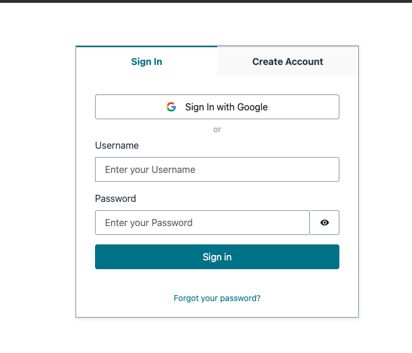

# Link Social account (google/facebook) to AWS Cognito user.

## Introduction

By default, AWS Cognito does not support linking social account (google/facebook) to AWS Cognito user. This project is to provide a solution to link social account to AWS Cognito user.

Assume you have a website and you provide many ways for users to login, such as username/password, google, facebook, etc. If the user initially registers with their email, adds some products to their cart, then visits the site on their phone and logs in via Facebook, the cart would be empty. That is because the default behavior is to create two separate accounts, even though they have the same email.

This project is to provide a solution to link social account to AWS Cognito user. The solution is to use pre-signup trigger to check if the user already exists in the user pool. If the user already exists, then link the social account to the user. If the user does not exist, then create a new user.

## Requirements

- AWS CLI already configured with Administrator permission
- A google project with google+ API enabled
- Node.js >= 10.0.0

## Project layout

This demo project is a monorepo that contains the following projects:

- `cdk` - The backend serverless application that contains the lambda function and the Cognito user pool.
- `webapp` - The frontend application that contains the Vue.js application and the Amplify configuration.

## Setting up the Cognito

### Create a Cognito user pool

```typescript
const userPool = new cognito.UserPool(this, 'UserPool', {
  selfSignUpEnabled: true, // allow users to sign up themselves
  signInAliases: {
    email: true // allow users to sign in with their email
  },

  standardAttributes: {
    email: { required: true, mutable: true }
  },

  passwordPolicy: {
    minLength: 8,
    requireLowercase: false,
    requireDigits: false,
    requireUppercase: false,
    requireSymbols: false
  },

  removalPolicy: cdk.RemovalPolicy.DESTROY, // we want to destroy the user pool when we destroy the stack. This is for testing purposes only.

  lambdaTriggers: {
    preSignUp: preSignUpLambda
  }
});
```

To order to link social account to Cognito user, we need to add a pre-signup trigger to the Cognito user pool. The pre-signup trigger will check if the user already exists in the user pool. If the user already exists, then link the social account to the user. If the user does not exist, then create a new user. The pre-signup trigger is implemented in the `pre-signup` lambda function.

```typescript
const preSignUpLambda = new NodejsFunction(this, 'PreSignUpLambda', {
  runtime: lambda.Runtime.NODEJS_18_X, // we use node 18 for aws-sdk v3 support
  handler: 'preSignup',
  entry: 'functions/triggers/index.ts',
  bundling: {
    externalModules: ['aws-sdk'],
    minify: false
  }
});
```

The `pre-signup` lambda function is implemented in `functions/triggers/index.ts`. The `pre-signup` lambda function will need to access the Cognito user pool. We need some IAM permissions to allow the lambda function to access the Cognito user pool. We will add the IAM permissions to the lambda function role.

```typescript
preSignUpLambda.role?.attachInlinePolicy(
  new iam.Policy(this, 'PreSignUpLambdaPolicy', {
    statements: [
      new iam.PolicyStatement({
        effect: iam.Effect.ALLOW,
        actions: [
          'cognito-idp:AdminLinkProviderForUser', // this is needed to link the user's Google account to the user pool
          'cognito-idp:ListUsers', // this is needed to get the user by email
          'cognito-idp:AdminCreateUser', // this is needed to create the user if it doesn't exist
          'cognito-idp:AdminSetUserPassword', // this is needed to set the user's password
          'cognito-idp:AdminUpdateUserAttributes' // this is needed to update the user's attributes
        ],
        resources: [userPool.userPoolArn]
      })
    ]
  })
);
```

### Settings for google OAuth

1. Go to [Google API Console](https://console.developers.google.com/apis/dashboard) and create a new project.
2. Go to Credentials page and create a new OAuth client ID.
3. Select Web application as the application type.
4. Add cognito user pool domain as the authorized JavaScript origins.
5. Add cognito user pool domain as the authorized redirect URIs. The redirect URI should be in the format of `https://<cognito user pool domain>/oauth2/idpresponse`.
6. Add the client ID and client secret to the Cognito user pool.

```typescript
const googleProvider = userPool.addIdentityProvider('Google', {
  providerName: 'Google',
  clientId: 'google client id',
  clientSecret: 'google client secret',
  attributeMapping: {
    email: 'email'
  }
});
```

## Setting up the frontend

In the frontend, we will use Amplify to sign in with google. We will also use Amplify to get the current user. The Amplify configuration is in `webapp/src/aws-exports.js`. The Amplify configuration contains the Cognito user pool information.

```javascript
const awsmobile = {
  aws_project_region: 'us-east-1',
  aws_cognito_identity_pool_id: 'us-east-1:xxxxxxxx-xxxx-xxxx-xxxx-xxxxxxxxxxxx',
  aws_cognito_region: 'us-east-1',
  aws_user_pools_id: 'us-east-1_xxxxxxxxx',
  aws_user_pools_web_client_id: 'xxxxxxxxxxxxxxxxxxxxxxxxxx',
  oauth: {
    domain: 'xxxxxxxxxx.auth.us-east-1.amazoncognito.com',
    scope: ['email', 'openid', 'profile'],
    redirectSignIn: 'http://localhost:8080/',
    redirectSignOut: 'http://localhost:8080/',
    responseType: 'code'
  },
  federationTarget: 'COGNITO_USER_POOLS'
};
```


## Running the demo

1. Run `yarn install` in the `cdk` and `webapp` folders.
2. Rename `env.sh.template` to `env.sh`. Update the `env.sh` file with your own values.
   2. `GOOGLE_CLIENT_ID` - The google client ID.
   3. `GOOGLE_CLIENT_SECRET` - The google client secret.
3. Run `deploy.sh` to deploy the backend.
4. Update the `webapp/src/aws-exports.js` file with the Cognito user pool information.
5. Run `yarn dev` in the `webapp` folder to start the frontend application.

